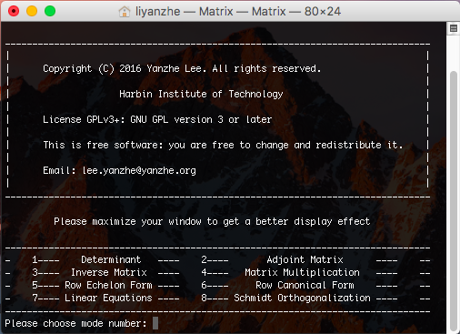
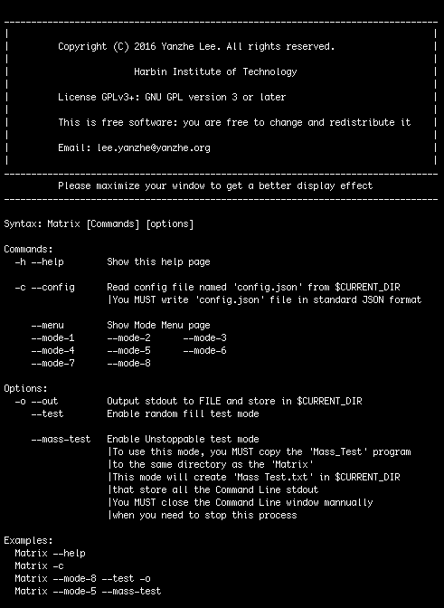
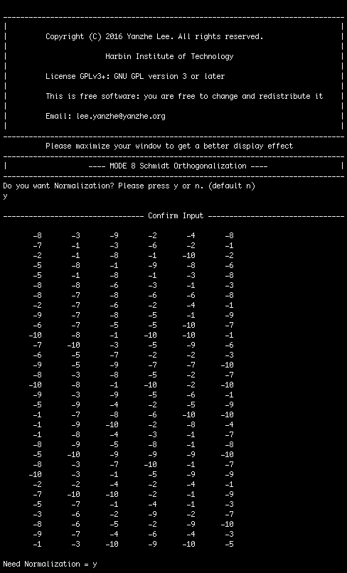
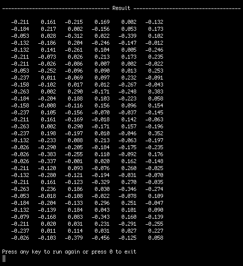
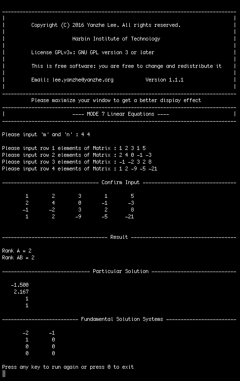
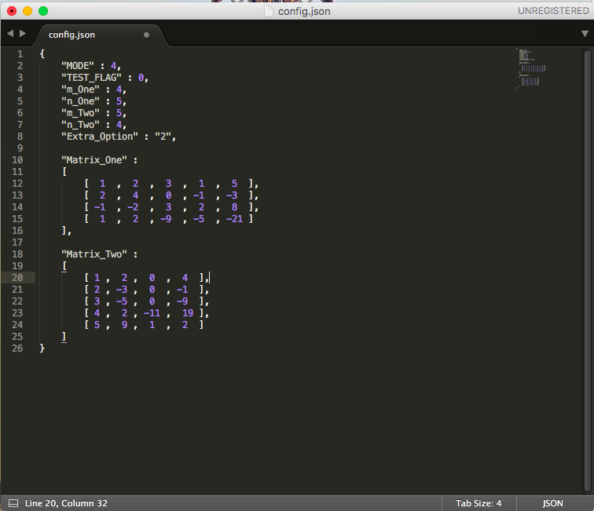

# Matrix

### Matrix is a command line application which is used for solving simple linear algebra problems.

### This program mainly suit for UNIX/Linux plaforms, but files in "Matrix" folder is still compatible with Windows (With some functions disabled)

### All source code file except "cJSON.c" and "cJSON.h" are written by Yanzhe Lee.

### Having tested quantities times,this program works perfectly on OSX system.

There are some MODEs that you can choose to solve different kinds of problems.

Some MODE will ask you to input the value of 'm' or ‘n', which represents row and column number of a matrix.

According to mathematics principles, Inverse Matrix, Adjoint Matrix and Determinant are only available for Square Matrix.

### Here shows some screen-cut image

#### Some examples

#### Example Configuration File in JSON format

