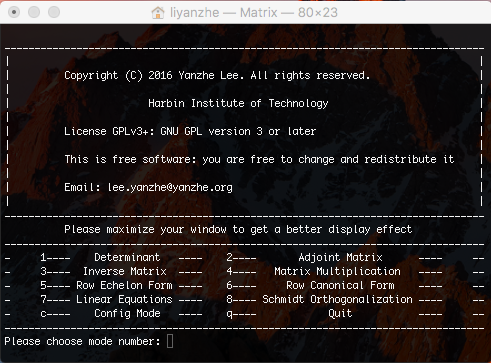
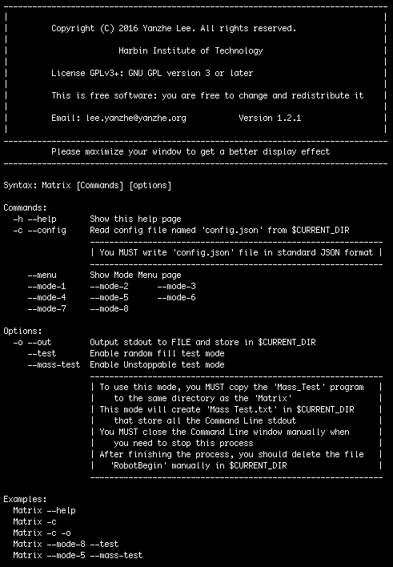
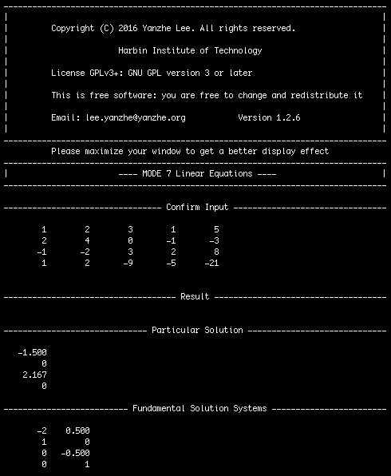

# Matrix

### Description
Matrix is a command line application which is used for solving simple linear algebra problems.

This program works well on UNIX/Linux plaforms, but files in "Matrix" folder is still compatible with Windows (With some functions disabled)

All source code file except "cJSON.c" and "cJSON.h" are written by Yanzhe Lee.

### Story of this project

This is the first programming project of me when I started first year CS courses at HIT.

So the implementations of matrix operations are very naive without any optimization.

I just use this project for learning C language as well as Linear Algebra.

### Features

There are some MODEs that you can choose to solve different kinds of problems.

Some MODE will ask you to input the value of 'm' or ‘n', which represents row and column number of a matrix.

According to mathematics principles, Inverse Matrix, Adjoint Matrix and Determinant are only available for Square Matrix.

### Here shows some screen-cut image





#### Some examples




#### Example Configuration File in JSON format

```json
{
	"MODE" : 7,
	"TEST_FLAG" : 0,
	"m_One" : 3,
	"n_One" : 5,
	"m_Two" : 5,
	"n_Two" : 4,
	"Extra_Option" : "y",
	
	"Matrix_One" :
	[
	 [1,-7,0,6,5],
	 [0,0,1,-2,-3],
	 [-1,7,-4,2,7]
	 ],
	
	"Matrix_Two" :
	[
	 [ 1 ,  12 ,  0  ,  4  ],
	 [ 2 , -23 ,  0  , -1  ],
	 [ 3 , -51 ,  0  , -9  ],
	 [ 4 ,  21 , -11 ,  19 ],
	 [ 5 ,  29 ,  1  ,  2  ]
	 ]
}
```
